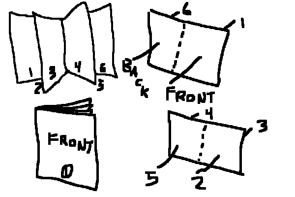

# Zine Maker (WIP)

(Warning: If you're reading this it means this is the very first version of the Zine Maker so it's only been tested to work for my use case which is fitting two jpg's onto each page as you can see in the graphic below. This script doesn't generate anything visual yet, it just tells you which files go on which page to help you when you're printing them out.)



This python script helps you determine the printing layout of a zine based on how many 'subpages' (the pages you read in a zine, not the paper the zine is printed on) you would like to print onto sheets of paper. 

## Example Usage:
```
$ python main.py 47 False 2 jpg
>You requested: 47 subpages, 2 subpages per page
>Inserting 2 subpages for front/back covers
>Inserting 1 additional subpages to fill last page
S001    P001:   ['000.jpg', '051.jpg']
S001    P002:   ['001.jpg', '050.jpg']
S002    P003:   ['002.jpg', '049.jpg']
S002    P004:   ['003.jpg', '048.jpg']
S003    P005:   ['004.jpg', '047.jpg']
S003    P006:   ['005.jpg', '046.jpg']
S004    P007:   ['006.jpg', '045.jpg']
S004    P008:   ['007.jpg', '044.jpg']
S005    P009:   ['008.jpg', '043.jpg']
S005    P010:   ['009.jpg', '042.jpg']
S006    P011:   ['010.jpg', '041.jpg']
S006    P012:   ['011.jpg', '040.jpg']
S007    P013:   ['012.jpg', '039.jpg']
S007    P014:   ['013.jpg', '038.jpg']
S008    P015:   ['014.jpg', '037.jpg']
S008    P016:   ['015.jpg', '036.jpg']
S009    P017:   ['016.jpg', '035.jpg']
S009    P018:   ['017.jpg', '034.jpg']
S010    P019:   ['018.jpg', '033.jpg']
S010    P020:   ['019.jpg', '032.jpg']
S011    P021:   ['020.jpg', '031.jpg']
S011    P022:   ['021.jpg', '030.jpg']
S012    P023:   ['022.jpg', '029.jpg']
S012    P024:   ['023.jpg', '028.jpg']
S013    P025:   ['024.jpg', '027.jpg']
S013    P026:   ['025.jpg', '026.jpg']
> 13 Sheets;26 Pages;50 Subpages;
```